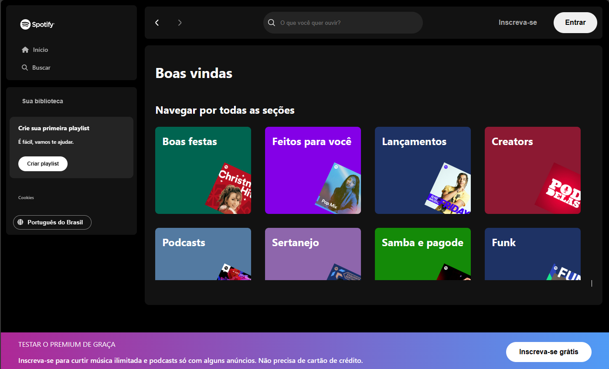

# Alura - Imersão Front-End - Spotify

**Projeto** de recriar a página inicial do *Spotify* por meio do HTML, CSS e JavaScript.
*Extra:* Versão em ReactJS



**Para rodar a JSON API**
```bash
npm i json-server -g
json-server --watch api-artists/artists.json --port 3000
```


